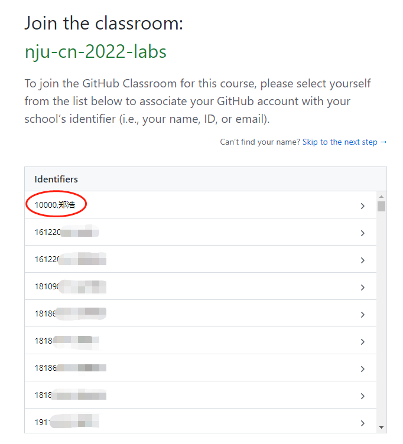

# Task 3: Hand in & Find answers

## GitHub Classroom

We use [GitHub Classroom](https://classroom.github.com) as your lab assignment platform. Make sure you have a [GitHub](https://github.com) account and have signed in.

The overall workflow to submit an assignment is as follows:

1. Click the assignment link we provide in each lab’s manual.
2. Select yourself from the student list to associate your GitHub account with your school's identifier (see figure below). If you cannot find yourself on the list, please contact TA (郑学长， QQ: 892552162).
3. Accept to initialize a repository by your account name. This will create a repository with a URL similar to: [https://github.com/nju-cn-course/lab-1-YourName](https://github.com/nju-cn-course/lab-1-YourName).
4. Go to the repository by clicking the URL. Clone the repository to your local machine.
5. Modify the code to finish the assignment and commit the code.
6. Push the code to the GitHub repository. Now we will receive your assignment.

You will walk through the workflow in [Task 4](modification.md).

For each lab, you can use pull request to raise issues and give us feedback.

