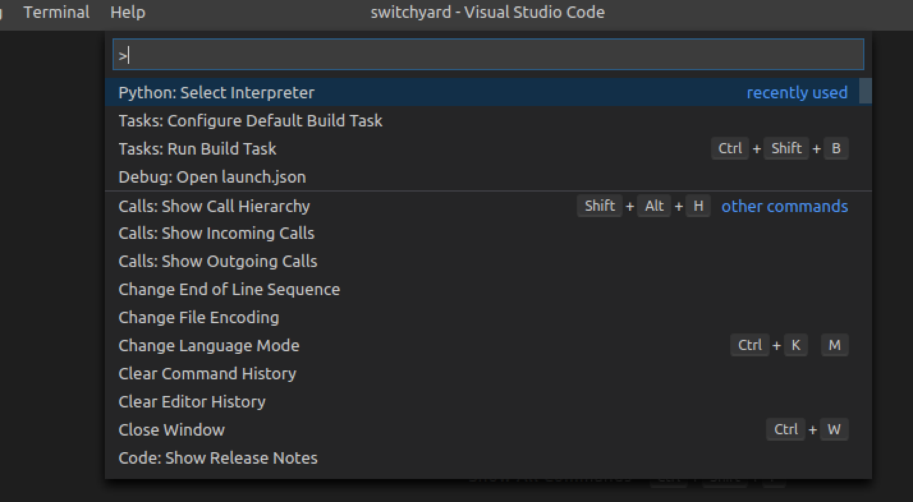
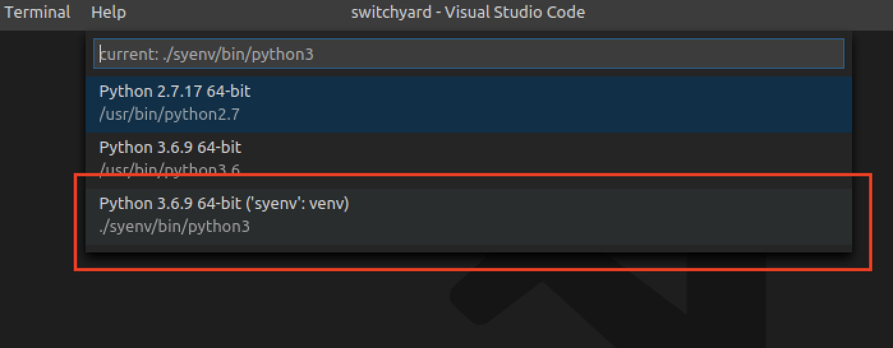
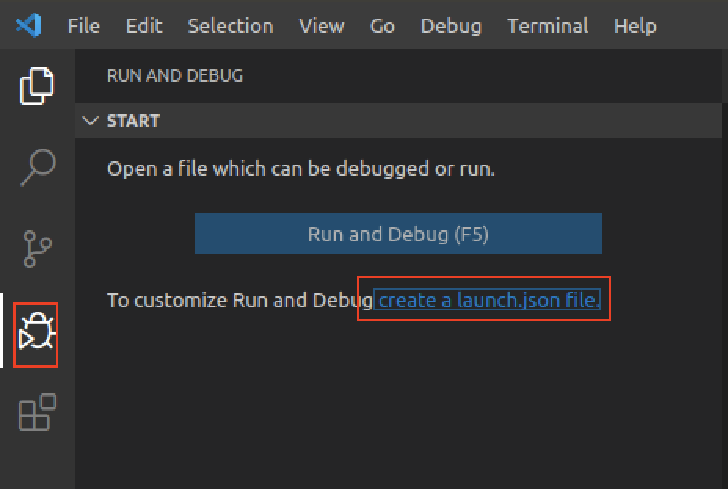

# VS Code

You can use Visual Studio Code (VSC) to develope your projects. Visual Studio Code is currently one of the most welcomed editor. It is open-source and has a large number of extensions. I will show how to install it and introduce some plugins may help you. This tutorial is prepared for those who want to take full control of Switchyard in one editor. We use Ubuntu 18.04 here. As we have provided the VM image with VSC preinstalled, you can skip the installation.

We expect that you will spend several hours on this.

## Install VSC

You can choose the VM image with VSC preinstalled. But someone like to install it themselves. The easiest way to install Visual Studio Code for Debian/Ubuntu based distributions is to download and install the [.deb package (64-bit)](https://go.microsoft.com/fwlink/?LinkID=760868), either through the graphical software center if it's available, or through the command line with:

```
$ sudo apt install ./<file>.deb
```

## Develope Switchyard with VSC


Here we will get in touch with Switchyard in advance. You can just skim the content of Switchyard now. After reading the section [Switchyard](switchyard.md), come back again.


Open the folder of Switchyard in VSC. You can open files in the explorer and edit them.


Then there are some plugins you may want to install. For Python, check this extension and install it.

.png>)

Next open any Python files and you will see a pop-up message ask you whether you want to install a linter. Pylint is enough to use so install it.


You have got almost every thing you need here. But you may want to format your document by right click on your editor and choose "Format Document". VSC will tell you that you need to install a formatter. Yapf is better for me but you are free to use others.

.gif>)

## Switch Python Virtual Environment

We recommand using a virtual environment of Python for Switchyard module. We introduce this in Switchyard section that you need to activate the environment for Switchyard to be used. However, this activation **ONLY** takes effect in that exactly one terminal session, which means that the VS Code has no idea where is your Switchyard so that it cannot support features like code completion.

To solve this, tell VS Code to switch to the virtual environment you created.

Press `Shift+Ctrl+P` on Windows/Linux or `Shift+Cmd+P` on macOS to open _Command Pallette_ and type "Python: Select interpreter". Then choose the Python with the path corresponding to the `syenv` you created.





You can also set this in your workspace settings for running tasks below.

Press `Shift+Ctrl+P` on Windows/Linux or `Shift+Cmd+P` on macOS to open _Command Pallette_ and type "Preferences: Open Workspace Settings". This will create a `.vscode/settings.json` file in your workspace.

Edit `.vscode/settings.json` like this:

```bash
{
    "python.pythonPath": "/home/njucs/switchyard/syenv/bin/python3"
}
```

Notice that you should change the path to the one on your machine.

## Run Switchyard

You can simply open the terminal either in VS Code or in you Linux and input the command to run switchyard. But VS Code provides an easy way to run a command with a only shortcut. You can use this feature to run Switchyard test. However, if you are tired to configure as below, just skip to next section.

*   First you need to create a `tasks.json` in your workspace:

    Press `Shift+Ctrl+P` on Windows/Linux or `Shift+Cmd+P` on macOS to open _Command Pallette_ and type "Tasks: Configure Task". Choose "Create tasks.json from template", choose "Others". Now you have a `.vscode/tasks.json` file for tasks running configuration.
*   Edit `.vscode/tasks.json` as follows:

    ```javascript
    {
        // See https://go.microsoft.com/fwlink/?LinkId=733558
        // for the documentation about the tasks.json format
        "version": "2.0.0",
        "tasks": [
            {
                "label": "run switchyard test",
                "type": "shell",
                "command": "${config:python.pythonPath}",
                "args": [
                    "-m",
                    "switchyard.swyard",
                    "-t",
                    "${fileDirname}/${fileBasenameNoExtension}_testscenario.py",
                    "${file}"
                ],
                "group": {
                    "kind": "build",
                    "isDefault": true
                }
            }
        ]
    }
    ```
* Open `examples/myhub.py` file. Press \`Shift+Ctrl+B" on Windows/Linux or "Shift+Cmd+B" on macOS to run build task.

Now let's see what is configured in the `tasks.json` . Recall that we normally run a Switchyard test in terminal with command below:

```bash
$ swyard -t examples/myhub_testscenario.py examples/myhub.py
```

Line 9 of `tasks.json` indicates that we want to run the exact Python we configured in `settings.json` as `python.pythonPath` . module `switchyard.swyard` (short for `python -m switchyard.swyard` ), which is the exactly `swyard` command we run when we want to start Switchyard.

Line 10-16 store the arguments for `swyard` command to run.

*   `{fileDirname}/${fileBasenameNoExtension}_testscenario.py` in `launch.json` uses some _predefined variables_ (that starts with '$") in VS Code:

    * `${fileDirname}` : the directory name of current opened file. So when we opened `examples/myhub.py` in the editor, the `${fileDirname}` matches the directory of `examples`&#x20;
    * `${fileBasenameNoExtension}` : the base name of current file with no extension which means when we opened `examples/myhub.py` , this variable matches `myhub`&#x20;

    So when we join the variables above, we will have

    `${fileDirname}/${fileBasenameNoExtension}_testscenario.py`

    corresponding to something like:

    `"examples" + "/" + "myhub" "_testscenario.py"`

    which results in

    `examples/myhub_testscenario.py`
* `${file}` is the current file name which in this case is `examples/myhub.py` .

So the `tasks.json` is configured to run a command:

```bash
$ /home/njucs/switchyard/syenv/bin/python3 -m switchyard.swyard -t \ 
examples/myhub_testscenario.py examples/myhub.py
```

You may wonder why this command is more complicated. The answer lies in the that: when we have activated the `syenv` environment and run `swyard` command, it is actually short for `/home/njucs/switchyard/syenv/bin/python3 -m switchyard.swyard` . The activation solves the full path for you so that you can run the command simply. But in VS Code you should configured the full path.

## Debug Switchyard with VSC

[Switchyard document about debug](https://jsommers.github.io/switchyard/test\_execution.html#if-you-don-t-like-pdb) shows that you are free to choose other debuggers. Let's replace pdb with VSC debugger. This will works when running in Switchyard test environment. For VSC, you need to create debugging configuration.

For example, if you want to debug `examples/myhub.py` with `examples/myhub_testscenario.py`, you need to create a `launch.json` for configuration.

1. Click the "Run and debug" icon in Activity Bar on the left (which is usually a little beetle), and click "create a launch.json file". Then choose "Python file". This will create a file named `.vscode/launch.json` in your opened directory which stores the configuration of the debugger.



1.  Edit `.vscode/launch.json` as follows:

    ```javascript
    {
        // Use IntelliSense to learn about possible attributes.
        // Hover to view descriptions of existing attributes.
        // For more information, visit: https://go.microsoft.com/fwlink/?linkid=830387
        "version": "0.2.0",
        "configurations": [
            {
                "name": "Python: Switchyard Test",
                "type": "python",
                "request": "launch",
                "module": "switchyard.swyard",
                "console": "integratedTerminal",
                "args": [
                    "-t",
                    "${fileDirname}/${fileBasenameNoExtension}_testscenario.py",
                    "${file}",
                    "--nohandle"
                ]
            }
        ]
    }
    ```

    The configuration is similar to `tasks.json` described above. The `--nohandle` is a flag for Switchyard not to trap exaception which is described in its [documentation](https://pavinberg.gitee.io/switchyard/test\_execution.html#if-you-don-t-like-pdb).
2. Open `examples/myhub.py` file. Set a breakpoint in your code and click the configuration to debug. Or just simply click "Run -- Start Debugging" or press "F5" to start debugging `examples/myhub.py` .

You can use this way in your configuration to easily debug your Switchyard program for later experiments.

## For Assignment

In the later section we introduced GitHub Classroom for assignment. For each assignment, you will have an independent directory. To use the VS Code configuration above, simply copy the whole directory `.vscode` to your new directory. For example:

```bash
$ cp -r ~/switchyard/.vscode /path/to/your/Lab-1-YourName
```

Then modify the `tasks.json` and `launch.json` to run the test correctly.

## Other editor/IDE

You of course can use other editors or IDEs if you prefer. Some other powerful tools you can choose are:

* IDE: PyCharm, Visual Studio
* Editor: Vim, Emacs

However, if you have always been using an IDE, we recommend you try out an editor.
